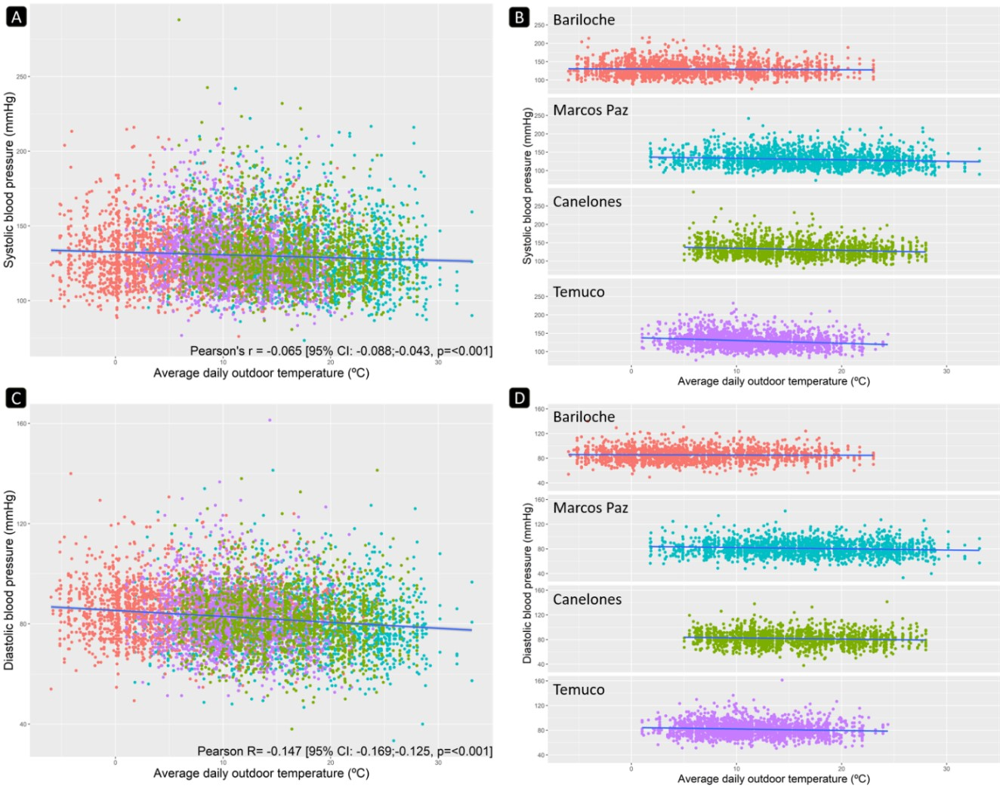

```{r setup, include=FALSE}
knitr::opts_chunk$set(echo = FALSE)
```


## Uso del paquete R 'nasapower' para unir base de datos meteorológicos con datos individuales de salud en el estudio CESCAS I en Argentina, Chile y Uruguay.

Santiago Melendi, **Marilina Santero**, Carolina Prado, Rosana Poggio, Natalia Elorriaga, Laura Gutierrez, Pablo Gulayin and Vilma Irazola.

# 


# 


## Introducción

Evidencia científica sugiere que la presión arterial (PA) podría variar según patrones climáticos.

Un aumento en la PA durante el invierno ha sido demostrado; sin embargo esta hipótesis no ha sido explorada aún en población general del cono sur de América Latina.


## Objetivo

Examinar el efecto de la temperatura media ambiente en los valores de presión arterial sistólica y diastólica en población general de 4 ciudades de Argentina, Chile y Uruguay.


## Métodos (I)

El estudio CESCAS I <https://estudiocescas.iecs.org.ar/en/> reclutó *7524* mujeres y hombres, de entre 35 y 74 años por un muestreo randomizado en *Marcos Paz* y *Bariloche* (Argentina), *Temuco* (Chile), y *Canelones* (Uruguay) entre Febrero 2010 y Diciembre 2011. 

La PA junto a otras mediciones a nivel individual, variables demográficas y de salud fueron evaluadas utilizando instrumentos validados. 

## CESCAS


## Métodos (II)

El **NASA Langley Research Center (LaRC) POWER Project** <https://power.larc.nasa.gov/> ofrece de manera gratuita bases de datos meteorológicas. 

*Datos de la temperatura diaria promedio para las 4 ciudades del estudio* fueron obtenidas y la temperatura promedio del día en que el participante se tomó la PA fue utilizada en el análisis. 

Pasos:
1. Merging datasets
2. Fitting linear regression models (5° temp y Verano -vs- Invierno)

## Métodos (III) R


-"NASA POWER API Client”<https://cran.r-project.org/package=nasapower> 

-package “survey”

-package “ggplot2”

-package “dplyr”


##Ética

- CEI Argentina, Chile, Uruguay, EEUU.

- Consentimiento informado

##
```
#Creating Numeric Variable for 5?C increases in temperature
cescas$Temp5C <- cut(cescas$T2M, seq(-10, 40, 5))
levels(cescas$Temp5C)
cescas$Temp5C <- recode(cescas$Temp5C, "(-10,-5]"=1, 
"(-5,0]"=2,   "(0,5]"=3,  "(5,10]"=4,   "(10,15]"=5,
"(15,20]"=6,  "(20,25]"=7,  "(25,30]"=8,  "(30,35]"=9,  "(35,40]"=10 )

#Aggregate Low an dmoderate CV Risk (0=Low and Modearte, 2=High)
cescas$fram_risk_c <- recode(cescas$fram_risk, '1'=0, '0'=0, '2'=2)

#Creating Seasonality Variable Summer=0 Winter=1
cescas$winter <- NA
cescas$winter[cescas$month=="12"|cescas$month=="01"|cescas$month=="02"] <- 0
cescas$winter[cescas$month=="06"|cescas$month=="07"|cescas$month=="08"] <- 1

cescas$winter <- factor(cescas$winter,
                    levels = c("0","1"),
                    labels = c("Summer", "Winter"))
```


##
```
#Creating Season Variable Summer=1 Fall=2 Winter=3 Spring=4
cescas$season <- NA
cescas$season[cescas$month=="12"|cescas$month=="01"|cescas$month=="02"]<-1
cescas$season[cescas$month=="03"|cescas$month=="04"|cescas$month=="05"]<-2
cescas$season[cescas$month=="06"|cescas$month=="07"|cescas$month=="08"]<-3
cescas$season[cescas$month=="09"|cescas$month=="10"|cescas$month=="11"]<-4

cescas$season <- factor(cescas$season,
                        levels = c("1","2","3","4"),
                        labels = c("Summer", "Fall", "Winter", "Spring"))
```

##
```
#####  Survey complex design #####
cescassvy <- svydesign(id=~subjid, weights=~ponderador, strata=~str, data=cescas)

#95%CI for Overall Weighted Mean BP
svyttest(mu_sbp~0, cescassvy, na.rm=T)
svyttest(mu_dbp~0, cescassvy, na.rm=T)

#Weighted Mean BP by Season
table1<-as.matrix(svyby(~mu_sbp+mu_dbp,~season,design=cescassvy,svymean,ci=T, level=0.95, na.rm=T))

#Weighted Mean BP for Summer and Winter
svyby(~mu_sbp+mu_dbp,~winter,design=cescassvy,svymean,ci=T,level=0.95,na.rm=T)

svyttest(mu_sbp~winter, cescassvy)
svyttest(mu_dbp~winter, cescassvy)
```
##
```
# Scatterplot for Mean Temp - SBP
ggplot(cescas, aes(x=T2M, y=mu_sbp)) + 
  geom_point(aes(col=sitio)) + 
  geom_smooth(method="lm", se=T) + 
  labs(caption= "Pearson's r = -0.065 [95% CI: -0.088;-0.043, p=<0.001]",
       x="Average daily outdoor temperature (?C)", 
       y="Systolic blood pressure (mmHg)")+
  theme(legend.position = "none", 
        axis.title = element_text(size=18),
        plot.caption = element_text(size=18, hjust=1, vjust=22))
```


##Resultados

- **Por cada 5°C de aumento ** en la temperatura media, en promedio se reduce la **PAS** en **0.64** mmHg (95% CI: -0.94; -0.35) y la **PAD** en **1.03** mmHg (95% CI: -1.22; -0.84).


##


*Relación entre temperatura (°C) y PAS (A & B) y PAD (C & D) en 4 ciudades del cono Sur de LA (2010-2012).*


##Resultados (II)

- En **invierno** la PAS fue en promedio 3.66 mmHg más alta que en **verano** y la PAD aumentó 1.55 mmHg.

- Sin embargo, existe variabilidad entre las ciudades. En Marcos Paz y Canelones durante el invierno la PAS aumenta en promedio más de 6 mmHg, mientras que en Bariloche no se observan diferencias entre las estaciones tanto para PAS como PAD.

- El efecto del invierno sobre la PA fue más marcado en PAS que en PAD y más acentuado en **adultos mayores, alto riesgo cardiovascular, y personas con historia de hipertensión o diabetes**.


##Conclusión
- La PA se asocia con la temperatura ambiente en 3 ciudades estudiadas (Temuco, Marcos Paz, y Canelones).

- La PA es mayor durante invierno, lo cual debería ser considerado en la práctica clínica y en la toma de decisiones. Curiosamente, la asociación no se observa en Bariloche, posiblemente porque a pesar de exristir las estaciones, las temperaturas son menores durante todo el año comparadas con las otras ciudades. 


##Conclusión (II)
- A través del software R, se pudo realizar el análisis estadístico y representaciones gráficas en forma relativamente sencilla. Destaca la flexibilidad y la diversidad de funciones.

- Con R y RStudio tenemos una infinidad de posibilidades, tanto analíticas como visuales para trabajar con los datos de una investigación en salud.


## 

             ,;;;,   ,;;;,
              ;;;;;;;,;;;;;;;
     .:::.   .::::;;;;;;;;;;;
    :::::::.:::::::;;;;;;;;;'
    :::::::::::::::;;;;;;;'
    ':::::::::::::';;;;;'
      ':::::::::'   ';'
        ':::::'
          ':'
          
                     
**Muchas muuuchas Gracias!!**

msantero@iecs.org.ar
@SanteroMarilina 


